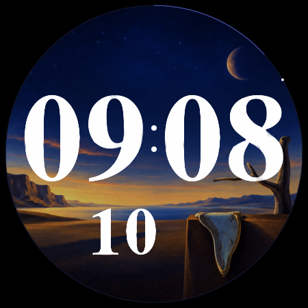

# Daliclock

Melting digits for your wrist. A Wear OS watch face with the original
[XDaliClock](https://www.jwz.org/xdaliclock/) letterforms, a surreal dusk landscape,
and a seconds dot that glides around the dial.

<p align="center">
  
</p>

The digits stretch and flow into the next time, with a brief blue-white highlight
and a faint trailing image. In always-on mode, only the hours and minutes remain,
in gray on black.

- System 12- or 24-hour time
- Optional seconds and date
- White, green, or amber digits
- Minute-progress ring and continuous seconds dot
- English and German settings

**Requires Wear OS 6 or later (API 36).** Daliclock uses Watch Face Format 4;
Wear OS renders the face directly. The package contains no executable app code,
network permissions, ads, or analytics.

## Download and install

[**Download the latest preview APK**](https://github.com/mayflower/daliclock/releases/download/preview/daliclock.apk)
· [Build details and checksum](https://github.com/mayflower/daliclock/releases/tag/preview)

Enable wireless debugging on your Wear OS 6 watch, pair and connect it with ADB,
then install the APK and choose **Daliclock** in the watch face picker:

```sh
adb devices
adb -s SERIAL install -r daliclock.apk
```

Replace `SERIAL` with your watch's identifier. Preview builds share a dedicated
signing key, so you can install updates over an earlier preview. A local debug
build or Play Store build uses a different key; uninstall it before switching.
Uninstalling removes the watch face's settings.

The [Build APK workflow](https://github.com/mayflower/daliclock/actions/workflows/apk.yml)
runs on pushes to `main` and can also be started manually. Successful builds
update the preview download and keep an APK artifact for 30 days.

## Build

You need JDK 17, Python 3.13, Android SDK Platform 36, and Build Tools 36.0.0.
Gradle 8.13 is included through the wrapper. CairoSVG also needs the Cairo
system library; on macOS, install it with `brew install cairo`.

Point `ANDROID_HOME` at your Android SDK, then run:

```sh
python3.13 -m venv .venv
.venv/bin/python -m pip install -r requirements-dev.txt
./gradlew :watchface:assembleDebug :watchface:bundleRelease \
  -PpythonExecutable="$PWD/.venv/bin/python"
```

The build generates the watch face resources from the checked-in digit curves
and artwork. It does not download fonts.

| Output | Path | Signing |
| --- | --- | --- |
| APK | `watchface/build/outputs/apk/debug/watchface-debug.apk` | Debug key |
| AAB | `watchface/build/outputs/bundle/release/watchface-release.aab` | Unsigned by default |

See [release instructions](store/README.md) to configure an upload key and
prepare a Google Play release.

## Try it

Install the debug APK on a Wear OS 6 device or emulator, replacing `SERIAL`
with its identifier from `adb devices`:

```sh
adb -s SERIAL install -r watchface/build/outputs/apk/debug/watchface-debug.apk
```

Choose **Daliclock** in the watch face picker. The [environment notes](SETUP.md)
include the tested Apple Silicon emulator configuration and Vulkan workarounds.

For a local browser preview of digit transitions:

```sh
.venv/bin/python tools/preview_morphs.py
```

Open `build/preview/index.html`. This previews the shared digit geometry;
the image above is a generated preview of the complete face.

## Development

The Python generator turns coordinated digit curves into short, connected WFF
lines. Each shared point has one native animation owner; adjoining endpoints
follow it through references. Position and stroke width change together over
650 ms. Always-on glyphs are rasterized from the same curves at build time.

- [`assets/glyphs/`](assets/glyphs/) — original outlines and derived digit curves
- [`config/daliclock.json`](config/daliclock.json) — layout and animation settings
- [`tools/daliclock/`](tools/daliclock/) — shared geometry, preview, and WFF export
- [`tools/generate_watchface.py`](tools/generate_watchface.py) — resource generation
- [`watchface/`](watchface/) — Android resource-only package

Run the geometry and exporter tests:

```sh
.venv/bin/python -m unittest discover -s tests -v
```

After building, run Google's WFF schema validator and memory evaluator with:

```sh
tools/validate_wff.sh
```

The validator requires `WFF_VALIDATOR_JAR` and `WFF_MEMORY_JAR`;
[SETUP.md](SETUP.md#official-wff-tools) records the pinned upstream revision
and tool configuration.

Active morphing, ambient minute changes, and wake have been exercised on the
Wear OS 6 emulator. Physical-watch performance and battery use have not yet
been measured.

## Credits

Daliclock's digits are derived from Jamie Zawinski's XDaliClock artwork,
including its tapered strokes and serifs. The original artwork, conversion
notes, and permission notice are preserved in
[`assets/glyphs/xdaliclock`](assets/glyphs/xdaliclock/SOURCE.md).
